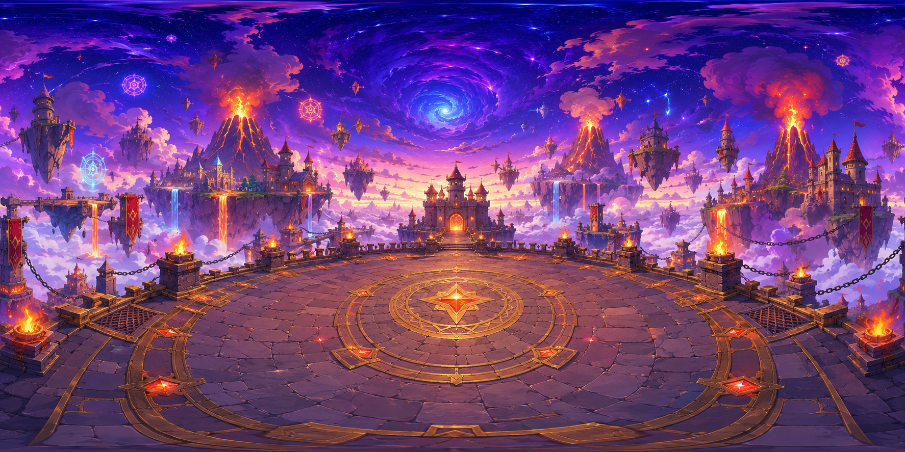

# まとあてシューティング — ゼロから作る完全ガイド

`shooting-kids.html` を一から再現するための実装ガイドです。

---

## 目次

1. [ゲーム概要](#1-ゲーム概要)
2. [ファイル構成](#2-ファイル構成)
3. [HTML骨格とCSS](#3-html骨格とcss)
4. [A-Frameシーン設定](#4-a-frameシーン設定)
5. [gallery-manager コンポーネント](#5-gallery-manager-コンポーネント)
6. [gallery-enemy コンポーネント](#6-gallery-enemy-コンポーネント)
7. [3ステージシステム](#7-3ステージシステム)
8. [ボス背景切り替え](#8-ボス背景切り替え)
9. [重要な技術パターン](#9-重要な技術パターン)

---

## 1. ゲーム概要

| 項目 | 内容 |
|------|------|
| エンジン | A-Frame 1.5.0 (WebXR) |
| 制限時間 | 90秒 |
| ステージ数 | 3 |
| 操作 | マウスクリック（ポインターロックなし、固定カメラ） |
| 判定方式 | スクリーン空間 NDC 距離（Raycaster 不使用） |

### ステージ構成

| ステージ | 内容 | クリア条件 |
|----------|------|------------|
| Stage 1 | 通常敵（ランダム色の球）が左右から出現 | 10体撃破 |
| Stage 2 | 中ボス（橙色の球）が分裂 → ミニ×2 | ミニを2体とも撃破 |
| Stage 3 | ラスボス（プロシージャルドラゴン）HP5 | ドラゴンを倒す |

---

## 2. ファイル構成

```
aframe-shooting-game/
├── shooting-kids.html      # すべてのコードを含む単一ファイル
└── images/
    └── last_boss.png       # ボスステージの背景画像（任意サイズ）
```

---

## 3. HTML骨格とCSS

`shooting-kids.html` はすべてのHTML/CSS/JSを1ファイルにまとめた構成です。

### 3-1. 必要な UI 要素

```html
<!-- HUD（ゲーム中のスコア・ステージ・タイマー表示） -->
<div id="hud">...</div>

<!-- 照準リング（画面中央固定） -->
<div id="ring"></div>
<div id="ring-dot"></div>

<!-- 各種テキスト表示 -->
<div id="announce"></div>      <!-- 中央メッセージ（一時表示） -->
<div id="stage-banner"></div>  <!-- ステージ開始バナー -->
<div id="hint">...</div>       <!-- 操作ヒント -->

<!-- ボスHPバー -->
<div id="boss-hp-wrap">
  <div id="boss-hp-label">ボス HP</div>
  <div id="boss-hp-bar"><div id="boss-hp-fill"></div></div>
</div>

<!-- オーバーレイ（スタート・ゲームオーバー・クリア） -->
<div id="start-screen" class="overlay">...</div>
<div id="game-over"    class="overlay">...</div>
<div id="win-screen"   class="overlay">...</div>
```

### 3-2. 照準リングのCSS

```css
#ring {
  position: fixed; top: 50%; left: 50%;
  transform: translate(-50%, -50%);
  width: 200px; height: 200px;
  border: 7px solid rgba(255,255,255,0.75);
  border-radius: 50%;
  pointer-events: none; z-index: 100; display: none;
  transition: border-color 0.08s, box-shadow 0.08s;
}
/* 敵がリング内に入ったら緑に光る */
#ring.ready {
  border-color: #00ff44;
  box-shadow: 0 0 30px #00ff44, 0 0 60px rgba(0,255,68,0.4);
}
```

### 3-3. スコアポップアップのCSS

```css
.popup {
  position: fixed;
  font-size: 40px; font-weight: bold; font-family: sans-serif;
  pointer-events: none; z-index: 200;
  animation: popAnim 0.85s ease-out forwards;
}
@keyframes popAnim {
  0%   { opacity: 1; transform: translateY(0) scale(1); }
  25%  { transform: translateY(-20px) scale(1.4); }
  100% { opacity: 0; transform: translateY(-90px) scale(0.7); }
}
```

---

## 4. A-Frameシーン設定

```html
<a-scene
  id="scene"
  gallery-manager
  vr-mode-ui="enabled: false"
  renderer="antialias: true"
  background="color: #87ceeb"
>
  <!-- 画像アセット（ボス背景） -->
  <a-assets>
    
  </a-assets>

  <!-- 通常ステージの背景 -->
  <a-sky id="sky" color="#87ceeb"></a-sky>
  <a-plane id="ground" rotation="-90 0 0" width="100" height="100"
    material="color: #5cb85c; roughness: 0.9"></a-plane>
  <a-entity id="clouds">
    <a-sphere position="-12 7 -22" radius="3" material="color:#fff;shader:flat;opacity:0.95"></a-sphere>
    <!-- 他の雲も同様に追加 -->
  </a-entity>

  <!-- ボスステージ背景（平面ビルボード、通常時は非表示） -->
  <a-plane id="boss-bg-plane"
    position="0 1.6 -22" width="75" height="44"
    material="src: #boss-bg; shader: flat"
    visible="false"></a-plane>

  <a-light type="ambient"     intensity="1.5" color="#ffffff"></a-light>
  <a-light type="directional" intensity="0.8" position="1 3 2"></a-light>

  <!-- 敵のコンテナ -->
  <a-entity id="enemies"></a-entity>

  <!-- カメラ（固定位置・向き固定） -->
  <a-camera id="cam" position="0 1.6 0"
    look-controls="enabled: false"
    wasd-controls="enabled: false"
    user-height="0">
  </a-camera>
</a-scene>
```

**ポイント:**
- `look-controls` と `wasd-controls` を無効化してカメラを完全固定
- `<a-scene gallery-manager>` と書くことで `gallery-manager` コンポーネントをシーン全体に適用

---

## 5. gallery-manager コンポーネント

`AFRAME.registerComponent('gallery-manager', {...})` でシーンに付与するゲーム管理コンポーネントです。

### 5-1. 初期化 (init)

```javascript
init() {
  this.score     = 0;
  this.timeLeft  = 90;
  this.state     = 'idle';     // idle | playing | gameover | win
  this.enemies   = new Set();  // 現在画面上にいる敵のSet
  this.stage     = 1;
  this.killCount   = 0;        // Stage1の撃破カウント
  this.minisKilled = 0;        // Stage2のミニ撃破カウント
  this.highScore   = parseInt(localStorage.getItem('kidsShootingHS') || '0');

  // DOM参照
  this.hudEl       = document.getElementById('hud');
  this.scoreEl     = document.getElementById('score-val');
  this.timerEl     = document.getElementById('timer-val');
  this.stageEl     = document.getElementById('stage-val');
  this.timerBoxEl  = document.getElementById('timer-box');
  this.ringEl      = document.getElementById('ring');
  this.ringDotEl   = document.getElementById('ring-dot');
  // ... 他の要素も同様に参照

  // ボタンイベント
  document.getElementById('start-btn')      ?.addEventListener('click', () => this.startGame());
  document.getElementById('restart-btn')    ?.addEventListener('click', () => this.startGame());
  document.getElementById('win-restart-btn')?.addEventListener('click', () => this.startGame());

  // クリック判定をバインド
  this._onClick = this._onClick.bind(this);
  document.addEventListener('mousedown', this._onClick);

  // 敵撃破イベント
  this.el.addEventListener('enemy-defeated', e => { /* 後述 */ });

  // 中ボス分裂イベント
  this.el.addEventListener('midboss-split', e => {
    this.minisKilled = 0;
    this.spawnMinis(e.detail.x, e.detail.y, e.detail.z);
  });
},
```

### 5-2. ゲーム開始 (startGame)

```javascript
startGame() {
  this.score     = 0;
  this.timeLeft  = 90;
  this.state     = 'playing';
  this.stage       = 1;
  this.killCount   = 0;
  this.minisKilled = 0;
  this.clearEnemies();
  clearInterval(this._spawnTimer);
  clearInterval(this._countdown);

  // UI表示切り替え
  this.startScreen.style.display    = 'none';
  this.gameOverScreen.style.display = 'none';
  this.winScreen.style.display      = 'none';
  this.hudEl.style.display          = 'flex';
  this.ringEl.style.display         = 'block';
  this.ringDotEl.style.display      = 'block';
  this.hintEl.style.display         = 'block';
  this.bossHpWrapEl.style.display   = 'none';

  // 通常背景に戻す
  document.getElementById('sky').setAttribute('visible', 'true');
  document.getElementById('ground').setAttribute('visible', 'true');
  document.getElementById('clouds').setAttribute('visible', 'true');
  document.getElementById('boss-bg-plane').setAttribute('visible', 'false');

  this.startStage1();

  // カウントダウン
  this._countdown = setInterval(() => {
    if (this.state !== 'playing') return;
    this.timeLeft--;
    this.updateHUD();
    if (this.timeLeft <= 10) this.timerBoxEl.className = 'hud-box danger';
    if (this.timeLeft <= 0)  this.endGame();
  }, 1000);
},
```

### 5-3. 敵撃破イベント処理

```javascript
this.el.addEventListener('enemy-defeated', e => {
  if (this.state !== 'playing') return;
  this.score += e.detail.pts;
  this.updateHUD();
  const big   = e.detail.pts >= 100;
  const color = big ? '#ff6600' : '#ffff00';
  this.showPopup(`+${e.detail.pts}`, color, big);
  if (!big) this.showAnnounce('やったー！🎉', '#ffff00');

  // Stage1: 10体倒したら次へ
  if (this.stage === 1) {
    this.killCount++;
    if (this.killCount >= 10) {
      clearInterval(this._spawnTimer);
      setTimeout(() => { if (this.state === 'playing') this.startStage2(); }, 800);
    }
  }

  // Stage2: ミニを2体倒したら次へ（逃げてもカウントしない）
  if (this.stage === 2 && e.detail.isMini) {
    this.minisKilled++;
    if (this.minisKilled >= 2) {
      setTimeout(() => { if (this.state === 'playing') this.startStage3(); }, 1000);
    }
  }
});
```

### 5-4. クリック判定 (_onClick)

スクリーン空間の NDC 座標で判定します（Raycaster 不使用）。

```javascript
_onClick(e) {
  if (e.button !== 0) return;
  if (e.target.tagName === 'BUTTON') return;
  if (this.state !== 'playing') return;

  const camera = document.getElementById('cam')?.getObject3D('camera');
  if (!camera) return;

  const wp = new THREE.Vector3();
  let closest = null, closestDist = Infinity;

  this.enemies.forEach(el => {
    if (el._dead || !el.object3D) return;
    // ワールド座標 → NDC（-1〜1 の正規化デバイス座標）
    el.object3D.getWorldPosition(wp);
    const p = wp.clone().project(camera);
    // NDC 原点からの距離（画面中央からの距離）
    const d = Math.sqrt(p.x * p.x + p.y * p.y);
    if (d < 0.38 && d < closestDist) { closest = el; closestDist = d; }
  });

  if (closest?.components?.['gallery-enemy']) {
    const comp = closest.components['gallery-enemy'];
    comp.hit();

    // ボスHPバー更新
    if (comp.data.type === 'boss') {
      this.bossHpFillEl.style.width = `${Math.max(0, (comp.health / 5) * 100)}%`;
    }

    if (!closest._dead) {
      const pts = comp.data.type === 'boss' ? 30 : 10;
      this.score += pts;
      this.updateHUD();
      this.showPopup(`+${pts}`, '#ffffff', false);
    }
  } else {
    this.showPopup('はずれ…', '#ffaaaa', false);
  }
},
```

**判定の仕組み:**
- `getWorldPosition()` で敵のワールド座標を取得
- `.project(camera)` でスクリーン空間 NDC に変換（中央が 0,0、端が ±1）
- `√(x²+y²) < 0.38` がリング内判定（リングの大きさに合わせて調整）

### 5-5. リング色の更新 (tock)

> **重要:** `tick` ではなく `tock` を使うこと！

```javascript
tock() {
  if (this.state !== 'playing') return;
  const camera = document.getElementById('cam')?.getObject3D('camera');
  if (!camera) return;

  const wp = new THREE.Vector3();
  let inRange = false;
  this.enemies.forEach(el => {
    if (el._dead || !el.object3D) return;
    el.object3D.getWorldPosition(wp);
    const p = wp.clone().project(camera);
    if (Math.sqrt(p.x * p.x + p.y * p.y) < 0.38) inRange = true;
  });

  this.ringEl.className = inRange ? 'ready' : '';
},
```

**なぜ `tock` か:**
- `tick` はレンダリング前に実行される
- `tock` はレンダリング後に実行される
- 敵の `tick` がレンダリング前に位置を更新するため、`tick` でリングを更新すると1フレーム遅れてしまう
- `tock` を使うことで「プレイヤーが実際に見ている位置」と「判定位置」が一致する

### 5-6. 敵のスポーン

```javascript
spawnNormal() {
  const lanes = [
    { y: 0.8,  z: -8 },
    { y: 1.6,  z: -9 },
    { y: 2.35, z: -8 },
  ];
  const lane     = lanes[Math.floor(Math.random() * lanes.length)];
  const fromLeft = Math.random() > 0.5;
  this._addEnemy('normal', fromLeft ? -12 : 12, lane.y, lane.z,
    `type: normal; fromLeft: ${fromLeft}; baseY: ${lane.y}`);
},

_addEnemy(type, x, y, z, attrs) {
  const container = document.getElementById('enemies');
  const e = document.createElement('a-entity');
  e.setAttribute('position', { x, y, z });
  e.setAttribute('gallery-enemy', attrs);
  container.appendChild(e);
  this.enemies.add(e);

  // 敵が破壊されたらSetから削除
  e.addEventListener('enemy-destroyed', () => {
    this.enemies.delete(e);
    // Stage3: ボス撃破でクリア
    if (this.stage === 3 && this.enemies.size === 0) {
      setTimeout(() => { if (this.state === 'playing') this.winGame(); }, 1200);
    }
  });
  return e;
},
```

---

## 6. gallery-enemy コンポーネント

```javascript
AFRAME.registerComponent('gallery-enemy', {
  schema: {
    fromLeft: { type: 'boolean', default: true },
    baseY:    { type: 'number',  default: 1.6  },
    type:     { type: 'string',  default: 'normal' }
  },
  ...
```

### 6-1. 敵タイプと初期パラメータ

```javascript
init() {
  this.el._dead = false;
  this.dir = this.data.fromLeft ? 1 : -1;
  this.t   = 0;

  switch (this.data.type) {
    case 'midBoss':
      this.health = 1; this.speed = 1.2 + Math.random() * 0.6;
      this.color = '#ff9800'; this.radius = 1.3;
      break;
    case 'mini':
      this.health = 1; this.speed = 3.0 + Math.random() * 1.5;
      this.color = '#ffd600'; this.radius = 0.42;
      break;
    case 'boss':
      this.health = 5; this.speed = 1.4;
      this.color = '#e53935'; this.radius = 1.8; this.bounceDir = 1;
      break;
    default: // normal
      this.health = 1; this.speed = 1.6 + Math.random() * 1.4;
      const pal = ['#f44336','#ff9800','#4caf50','#2196f3','#e91e63','#9c27b0','#00bcd4'];
      this.color = pal[Math.floor(Math.random() * pal.length)];
      this.radius = 0.72;
  }

  this.buildVisual();
},
```

### 6-2. 見た目の構築 (buildVisual)

boss以外は球体＋目のシンプルなアバター：

```javascript
buildVisual() {
  const type = this.data.type;

  if (type === 'boss') {
    this.el.classList.add('gallery-enemy');
    this._buildDragon();
    return;
  }

  // スケール係数（radiusに合わせてパーツをスケール）
  const sc = this.radius / 0.72;

  this.el.setAttribute('geometry', { primitive: 'sphere', radius: this.radius });
  this.el.setAttribute('material', { color: this.color, roughness: 0.35, metalness: 0.1 });
  this.el.classList.add('gallery-enemy');

  // 目（白目＋黒目）
  const addSphere = (px, py, pz, r, color) => {
    const s = document.createElement('a-sphere');
    s.setAttribute('radius', r * sc);
    s.setAttribute('position', `${px*sc} ${py*sc} ${pz*sc}`);
    s.setAttribute('material', `color: ${color}; shader: flat`);
    this.el.appendChild(s);
  };
  addSphere(-0.26, 0.22, 0.65, 0.16, '#fff');
  addSphere(-0.26, 0.22, 0.78, 0.09, '#111');
  addSphere( 0.26, 0.22, 0.65, 0.16, '#fff');
  addSphere( 0.26, 0.22, 0.78, 0.09, '#111');

  // 中ボスだけ★マーク追加
  if (type === 'midBoss') {
    const star = document.createElement('a-text');
    star.setAttribute('value', '★');
    star.setAttribute('color', '#fff');
    star.setAttribute('align', 'center');
    star.setAttribute('position', `0 0 ${this.radius + 0.05}`);
    star.setAttribute('scale', '4 4 4');
    this.el.appendChild(star);
  }
},
```

### 6-3. 移動ロジック (tick)

```javascript
tick(time, delta) {
  if (this.el._dead) return;
  const dt  = delta / 1000;
  this.t   += dt;
  const pos = this.el.object3D.position;

  if (this.data.type === 'boss') {
    // ボス: 左右バウンド ＋ サインカーブ上下
    pos.x += this.bounceDir * this.speed * dt;
    pos.y  = this.data.baseY + Math.sin(this.t * 1.2) * 0.35;
    if (pos.x >  6) { this.bounceDir = -1; pos.x =  6; }
    if (pos.x < -6) { this.bounceDir =  1; pos.x = -6; }

  } else if (this.data.type === 'mini') {
    // ミニ: バウンドして逃げられない ＋ 跳ねるたびスピードアップ
    pos.x += this.dir * this.speed * dt;
    pos.y  = this.data.baseY + Math.sin(this.t * 3.2) * 0.32;
    if (pos.x > 9) {
      this.dir = -1; pos.x = 9;
      this.speed = Math.min(this.speed * 1.25, 7.5);
      this._flashBounce();
    }
    if (pos.x < -9) {
      this.dir = 1; pos.x = -9;
      this.speed = Math.min(this.speed * 1.25, 7.5);
      this._flashBounce();
    }

  } else {
    // normal / midBoss: 一方向に進んで画面外で消える
    pos.x += this.dir * this.speed * dt;
    pos.y  = this.data.baseY + Math.sin(this.t * 1.8) * 0.18;
    if (pos.x > 14 || pos.x < -14) {
      this.el.emit('enemy-destroyed', {});
      if (this.el.parentNode) this.el.parentNode.removeChild(this.el);
    }
  }
},
```

### 6-4. ヒット処理 (hit)

```javascript
hit() {
  if (this.el._dead) return;
  this.health--;

  if (this.data.type === 'boss') {
    // ボス: スケールでつぶれエフェクト
    this.el.object3D.scale.set(1.25, 0.78, 1.25);
    setTimeout(() => {
      if (!this.el._dead) this.el.object3D.scale.set(1, 1, 1);
    }, 200);
  } else {
    // それ以外: 白フラッシュ ＋ つぶれる
    this.el.setAttribute('material', { color: '#ffffff', roughness: 0.35 });
    setTimeout(() => {
      if (!this.el._dead) this.el.setAttribute('material', { color: this.color, roughness: 0.35 });
    }, 100);
    this.el.object3D.scale.set(1.35, 0.65, 1.35);
    setTimeout(() => {
      if (!this.el._dead) this.el.object3D.scale.set(1, 1, 1);
    }, 180);
  }

  if (this.health <= 0) this.die();
},
```

### 6-5. 死亡処理 (die)

```javascript
die() {
  this.el._dead = true;
  this.spawnSparkles();

  if (this.data.type === 'midBoss') {
    // 分裂イベントを発火
    this.el.sceneEl.emit('midboss-split', {
      x: this.el.object3D.position.x,
      y: this.el.object3D.position.y,
      z: this.el.object3D.position.z
    });
    this.showSplitText();
    this.el.setAttribute('animation__die', { property: 'scale', to: '0.01 0.01 0.01', dur: 300, easing: 'easeInBack' });
    this.el.emit('enemy-destroyed', {});
    setTimeout(() => { if (this.el.parentNode) this.el.parentNode.removeChild(this.el); }, 350);

  } else if (this.data.type === 'boss') {
    this.el.setAttribute('animation__die', { property: 'scale', to: '0.01 0.01 0.01', dur: 700, easing: 'easeInBack' });
    // 爆発フラッシュ
    const pos = this.el.object3D.position;
    const flash = document.createElement('a-sphere');
    flash.setAttribute('radius', '0.6');
    flash.setAttribute('position', `${pos.x} ${pos.y} ${pos.z}`);
    flash.setAttribute('material', 'color:#ff6600;emissive:#ff6600;emissiveIntensity:3;transparent:true;opacity:0.9;shader:flat');
    flash.setAttribute('animation__s', 'property:scale;to:7 7 7;dur:600;easing:easeOutQuad');
    flash.setAttribute('animation__f', 'property:material.opacity;to:0;dur:600');
    this.el.sceneEl.appendChild(flash);
    setTimeout(() => { if (flash.parentNode) flash.parentNode.removeChild(flash); }, 660);

    this.el.sceneEl.emit('enemy-defeated', { pts: 200 });
    this.el.emit('enemy-destroyed', {});
    setTimeout(() => { if (this.el.parentNode) this.el.parentNode.removeChild(this.el); }, 750);

  } else {
    // normal / mini
    const isMini = this.data.type === 'mini';
    const pts    = isMini ? 30 : 50;
    this.el.setAttribute('animation__die', { property: 'scale', to: '0.01 0.01 0.01', dur: 280, easing: 'easeInBack' });
    this.el.setAttribute('material', { color: '#ffffff', emissive: '#ffffff', emissiveIntensity: 2 });
    // isMini フラグを付けて発火（gallery-manager でカウントに使う）
    this.el.sceneEl.emit('enemy-defeated', { pts, isMini });
    this.el.emit('enemy-destroyed', {});
    setTimeout(() => { if (this.el.parentNode) this.el.parentNode.removeChild(this.el); }, 320);
  }
},
```

---

## 7. 3ステージシステム

### ステージ遷移フロー

```
startGame()
  └─ startStage1()
       └─ enemy-defeated × 10 → startStage2()
            └─ midboss-split → spawnMinis()
                 └─ enemy-defeated (isMini) × 2 → startStage3()
                      └─ enemy-destroyed (boss) → winGame()
```

### Stage 1 スポーン

```javascript
startStage1() {
  this.stage     = 1;
  this.killCount = 0;
  this.showStageBanner('ステージ 1', '#ffffff');

  // 最初の2体は即座にスポーン
  this.spawnNormal();
  setTimeout(() => { if (this.state === 'playing' && this.stage === 1) this.spawnNormal(); }, 1200);

  // 2秒ごとに最大3体まで補充
  this._spawnTimer = setInterval(() => {
    if (this.state !== 'playing' || this.stage !== 1) return;
    if (this.enemies.size < 3) this.spawnNormal();
  }, 2000);
},
```

### Stage 2 中ボス

```javascript
startStage2() {
  this.stage = 2;
  this.clearEnemies();
  this.showStageBanner('ちゅうボス！', '#ff9800');
  this.showAnnounce('ちゅうボス とうじょう！', '#ff9800');

  // 2秒の演出後にスポーン
  setTimeout(() => {
    if (this.state === 'playing' && this.stage === 2) this.spawnMidBoss();
  }, 2000);
},
```

### Stage 3 ラスボス

```javascript
startStage3() {
  this.stage = 3;
  this.clearEnemies();
  this.showStageBanner('ラスボス！！', '#ff3333');
  this.showAnnounce('ラスボス とうじょう！！', '#ff3333');

  // 背景切り替え
  document.getElementById('sky').setAttribute('visible', 'false');
  document.getElementById('ground').setAttribute('visible', 'false');
  document.getElementById('clouds').setAttribute('visible', 'false');
  document.getElementById('boss-bg-plane').setAttribute('visible', 'true');

  setTimeout(() => {
    if (this.state === 'playing' && this.stage === 3) this.spawnBoss();
  }, 2200);
},
```

---

## 8. ボス背景切り替え

### なぜ `<a-sky>` のテクスチャ変更では駄目か

`<a-sky>` は通常の2D画像を球面に貼るため、画像が上半分にしか表示されない。
背景として使うには「360度パノラマ（エクイレクタングラー形式）」の画像が必要。

### 解決策: 平面ビルボード

代わりにカメラ正面に大きな `<a-plane>` を配置する。

```html
<a-plane id="boss-bg-plane"
  position="0 1.6 -22"
  width="75" height="44"
  material="src: #boss-bg; shader: flat"
  visible="false">
</a-plane>
```

**サイズの計算方法:**
- カメラからz=-22の距離: 22ユニット
- A-Frameデフォルト水平FOV ≒ 80度 → `tan(40°) × 22 × 2 ≈ 37` → 幅75で余裕をもたせる
- 16:9アスペクトで height = 75 × (9/16) ≈ 42 → 44に設定

**ステージ切り替え時の操作:**

Stage 3 開始時:
```javascript
document.getElementById('sky').setAttribute('visible', 'false');
document.getElementById('ground').setAttribute('visible', 'false');
document.getElementById('clouds').setAttribute('visible', 'false');
document.getElementById('boss-bg-plane').setAttribute('visible', 'true');
```

ゲーム再スタート時:
```javascript
document.getElementById('sky').setAttribute('visible', 'true');
document.getElementById('ground').setAttribute('visible', 'true');
document.getElementById('clouds').setAttribute('visible', 'true');
document.getElementById('boss-bg-plane').setAttribute('visible', 'false');
```

---

## 9. 重要な技術パターン

### パターン1: tick vs tock（フレーム同期）

| | tick | tock |
|--|------|------|
| 実行タイミング | レンダリング前 | レンダリング後 |
| 使いどころ | 敵の移動など物理更新 | UI更新（プレイヤーが見た状態に合わせる） |

リング色の更新は `tock` に入れること。`tick` に入れると「画面に見えている位置」と「リング色が変わる位置」がずれる。

### パターン2: NDCによるヒット判定

```javascript
// ワールド座標 → スクリーン空間NDC（-1〜1）
el.object3D.getWorldPosition(wp);
const p = wp.clone().project(camera);
const d = Math.sqrt(p.x * p.x + p.y * p.y);
if (d < 0.38) { /* リング内 */ }
```

`getWorldPosition()` は必須。`object3D.position` は**ローカル座標**のため親エンティティがあると正しい値にならない。

### パターン3: isMiniフラグによるステージ制御

Stage 2 のクリア判定は `enemies.size === 0` ではなく `isMini` フラグ付き `enemy-defeated` イベントのカウントで行う。

**理由:**
- ミニが画面外に逃げると `enemy-destroyed` が発火して `enemies.size` が 0 になる
- しかし「逃げた」ケースはプレイヤーが倒していないのでクリアにすべきでない
- `enemy-defeated` イベントは `die()` から発火 → 倒した時だけ発火する
- `enemy-destroyed` イベントは「破壊またはエスケープ」両方で発火する

```javascript
// ✅ 正しい: 倒した時だけカウント
if (this.stage === 2 && e.detail.isMini) {
  this.minisKilled++;
  if (this.minisKilled >= 2) this.startStage3();
}

// ❌ 間違い: 逃げた時もカウントされてしまう
if (this.stage === 2 && this.enemies.size === 0) {
  this.startStage3();
}
```

### パターン4: DOM フラグ (_dead)

```javascript
this.el._dead = false;  // init() で初期化

// die() で設定
this.el._dead = true;

// tick() の先頭でチェック
if (this.el._dead) return;

// Set のフィルタリングでも使用
this.enemies.forEach(el => {
  if (el._dead || !el.object3D) return;
  // ...
});
```

A-Frame のエンティティ（DOM要素）に直接フラグを付けることで、コンポーネントをまたいだ状態共有ができる。

### パターン5: A-Frameアニメーション（羽ばたき）

ウィング用の`<a-entity>`にA-Frame組み込みの`animation`コンポーネントを使う:

```javascript
pivot.setAttribute('animation',
  `property:rotation;from:${from};to:${to};dur:900;dir:alternate;loop:true;easing:easeInOutSine`);
```

- `dir:alternate` で往復アニメーション
- `loop:true` で無限ループ
- `easing:easeInOutSine` で自然な羽ばたき感

### パターン6: ハイスコアの保存

```javascript
// 読み込み
this.highScore = parseInt(localStorage.getItem('kidsShootingHS') || '0');

// 書き込み（更新時のみ）
if (this.score > this.highScore) {
  this.highScore = this.score;
  localStorage.setItem('kidsShootingHS', this.highScore);
}
```

---

## イベント一覧

| イベント名 | 発火元 | 受信先 | 内容 |
|-----------|--------|--------|------|
| `enemy-defeated` | `gallery-enemy.die()` | `gallery-manager.init()` | `{ pts, isMini }` 撃破スコアとフラグ |
| `enemy-destroyed` | `gallery-enemy`（逃げた or 死亡） | `gallery-manager._addEnemy()` | エンティティのSet削除トリガー |
| `midboss-split` | `gallery-enemy.die()` (midBoss) | `gallery-manager.init()` | `{ x, y, z }` ミニのスポーン位置 |

---

## スコア体系

| 敵タイプ | 撃破スコア |
|----------|------------|
| normal | 50点 |
| mini | 30点 |
| boss（ヒットごと） | 30点 |
| boss（撃破時） | 200点 |

ヒット時の即時スコアは `_onClick` で `+10` または `+30` として別途加算される点に注意。
撃破点は `enemy-defeated` イベント経由で `gallery-manager` が加算する。

---

## ローカルでの起動方法

```bash
cd aframe-shooting-game
npx serve .
# → http://localhost:3000/shooting-kids.html
```
